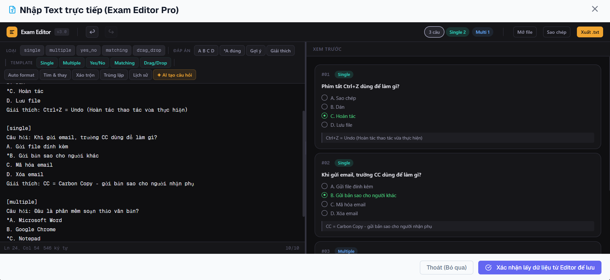
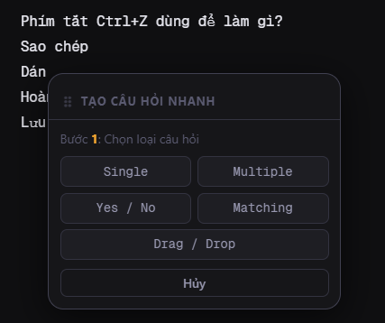

## Tổng quan

Để tạo một đề thi mới, trước hết bạn cần tạo phần thông tin cơ bản của đề. Sau khi lưu, hệ thống sẽ chuyển sang màn hình chỉnh sửa để bạn thêm câu hỏi theo phương thức phù hợp.


## Bước 1: Tạo đề thi mới

1. Mở mục **Đề thi** trong trang quản trị.
2. Chọn **Tạo đề thi mới**.
3. Nhập thông tin vào **form thông tin đề thi**.
4. Nhấn **Lưu thông tin đề thi** để chuyển sang màn hình chỉnh sửa.

## Bước 2: Chọn cách nhập câu hỏi

Trong trang chỉnh sửa đề thi mục I**mport**, bạn có thể tạo nội dung đề bằng 6 cách:

1. **Nhập Word/TXT**
2. **Nhập JSON**
3. **Nhập text trực tiếp (Live)**
4. **Nhập từ đề khác**
5. **Tạo đề bằng AI**
6. **Tạo đề ngoại ngữ (AI)**

Nên chọn cách nhập tùy theo nguồn dữ liệu bạn đang có. Nếu đã có ngân hàng câu hỏi dạng văn bản, nên dùng Word/TXT hoặc JSON. Nếu cần soạn nhanh và kiểm tra trực tiếp, nên dùng chế độ Live.

## Nhập Word/TXT

Cách này phù hợp khi bạn đã có sẵn nội dung câu hỏi trong file văn bản và muốn nhập nhanh vào hệ thống.

### Mẫu nội dung

```txt
[single]
Câu hỏi: Phím tắt Ctrl+Z dùng để làm gì?
A. Sao chép
B. Dán
*C. Hoàn tác
D. Lưu file
Giải thích: Ctrl+Z = Undo (Hoàn tác thao tác vừa thực hiện)

[multiple]
Câu hỏi: Đâu là phần mềm soạn thảo văn bản?
*A. Microsoft Word
B. Google Chrome
*C. Notepad
D. YouTube
Gợi ý: Chọn 2 đáp án
Giải thích: Word và Notepad đều là phần mềm soạn thảo

[yes_no]
Câu hỏi: Xét các mệnh đề sau về Internet:
- Internet là mạng toàn cầu -> yes
- Email là thư điện tử -> yes
- Google là hệ điều hành -> no
- Wi-Fi là kết nối không dây -> yes

[matching]
Câu hỏi: Ghép các thuật ngữ máy tính với định nghĩa:
- File <-> Tập tin lưu trữ dữ liệu
- Folder <-> Thư mục chứa các file
- RAM <-> Bộ nhớ tạm thời
- CPU <-> Bộ xử lý trung tâm

[drag_drop]
Câu hỏi: Ghép các thuật ngữ máy tính với định nghĩa:
- File <-> Tập tin lưu trữ dữ liệu
- Folder <-> Thư mục chứa các file
- RAM
- CPU
```

### Lưu ý khi nhập

- Dòng bắt đầu bằng `*` là đáp án đúng.
- Mỗi nhóm câu hỏi cần đúng định dạng theo loại câu.
- Nên kiểm tra lại nội dung sau khi nhập để tránh lỗi chính tả hoặc thiếu đáp án.

## Nhập JSON

Cách này phù hợp khi bạn có dữ liệu câu hỏi được xuất từ hệ thống khác hoặc đã chuẩn hóa theo cấu trúc JSON.

Khuyến nghị:

- Chỉ dùng khi dữ liệu đã đúng cấu trúc hệ thống yêu cầu.
- Nếu sau khi nhập có lỗi định dạng, nên kiểm tra lại từng trường dữ liệu trước khi lưu.
- Với bộ câu hỏi lớn, nên thử nhập một mẫu nhỏ trước.

## Nhập text trực tiếp (Live)

Chế độ này phù hợp khi bạn muốn nhập nhanh nội dung và kiểm tra câu hỏi ngay trong lúc soạn.



Bạn có thể nhập hoặc dán nội dung trực tiếp vào vùng soạn thảo. Trong một số thao tác, khi bôi đen nội dung và nhấp ra ngoài, hệ thống sẽ hiển thị hộp gợi ý để hỗ trợ tạo câu hỏi nhanh hơn.



Khuyến nghị:

- Dùng chế độ này để rà soát từng câu trước khi lưu.
- Phù hợp khi cần chỉnh sửa nhanh một phần nội dung do AI hoặc tài liệu ngoài sinh ra.

## Nhập từ đề khác

Cách này phù hợp khi bạn muốn tái sử dụng câu hỏi từ một đề đã có sẵn trong hệ thống.

Nên dùng khi:

- Cần tạo đề mới dựa trên cấu trúc của đề cũ.
- Muốn tiết kiệm thời gian soạn lại các câu hỏi đã dùng.
- Cần sao chép rồi chỉnh sửa một phần nội dung cho phù hợp với đợt thi mới.

Sau khi nhập từ đề khác, bạn nên kiểm tra lại:

- thời lượng làm bài
- số lượng câu hỏi
- đáp án và thang điểm
- nội dung đã cũ hoặc không còn phù hợp

## Tạo đề bằng AI

Hệ thống sẽ hỗ trợ bạn tạo prompt phù hợp để đưa vào công cụ AI. Sau khi AI sinh bộ câu hỏi, bạn có thể sao chép nội dung đó và đưa lại vào mục **Nhập text trực tiếp (Live)** để kiểm tra, chỉnh sửa và chuẩn hóa trước khi lưu chính thức.

Nên thực hiện theo trình tự sau:

1. Tạo prompt từ hệ thống.
2. Gửi prompt vào công cụ AI.
3. Sao chép nội dung AI trả về.
4. Dán vào mục **Nhập text trực tiếp (Live)**.
5. Kiểm tra lại từng câu hỏi, đáp án và giải thích.

Lưu ý:

- Không nên lưu ngay nội dung do AI tạo mà chưa rà soát.
- Cần kiểm tra lại độ chính xác của đáp án, ngữ nghĩa câu hỏi và mức độ phù hợp với môn học.

## Tạo đề ngoại ngữ (AI)

Cách làm tương tự như mục **Tạo đề bằng AI**, nhưng prompt sẽ được tối ưu hơn cho các đề thi ngoại ngữ.

Phù hợp khi bạn cần:

- tạo câu hỏi tiếng Anh hoặc ngôn ngữ khác
- sinh bài đọc, đoạn hội thoại hoặc câu hỏi ngữ pháp
- xây dựng đề theo mức độ từ cơ bản đến nâng cao

Sau khi AI tạo nội dung, bạn vẫn nên đưa về chế độ **Nhập text trực tiếp (Live)** để kiểm tra lại định dạng và chất lượng câu hỏi trước khi sử dụng.
